# 综合设计试验

## 1 综合整理

**题目**

My Job 信息平台

**亮点**

数据可视化、自然语言处理算法、推荐？（图谱可视化？）其他算法？

**目前瓶颈**

数据存储结构设计

数据获取

算法实现


填一个问卷，让我们更加了解你，根据这个问卷结果推荐职业信息

两种选择，NFC非迫选测试，[holland兴趣码](http://www.apesk.com/holland/index.html)，[MBTI职业倾向性测试](https://www.zhihu.com/question/19901116)


[MBTI入门+16型人格职业大全，你适合做什么？](https://zhuanlan.zhihu.com/p/342924180)

[holland职业索引](https://www.xycareer.com/knowledge/3783.html)


[104工作世界](https://wow.104.com.tw/index/main.html)，一个挺有趣的职业普及网站

通过104工作世界可以


holland code 工具样例:  https://github.com/muratyaman/holland-codes-personality-test-api

[MBTI测试工具](https://github.com/axiaoxin/mbti)


## 2 项目意义的重申

现在中国的学生在职业生涯的教育上是比较缺失的。很多时候根本不知道自己想要什么，兴趣在哪里，希望做什么工作。国内外对于人格和个人兴趣的研究已经有较多的成果，其中一些对于“发现我们想要什么”有一定参考意义。通过借助如holland测试，MBTI职业倾向性测试，我们可以获得一些用户（主要是高中生和大学本科低年级学生）在职业发展上的倾向，让用户了解更广阔丰富、多姿多彩的职业世界。


## 3 任务设计

### 爬虫

​	Holland码与任务设计

[1]  https://wow.104.com.tw/gt/career/list/type/I/S/R

【爬取】获取holland码为ISR的职业大类有哪些

**Method**: GET     **Return**:JSON

**Example**

```json
{"data":[{"bigJobImg":"https:\/\/static.104.com.tw\/gtnew\/img\/character\/bigRole\/2005003008.png","collectCount":12,"degreeView":"ON","holland1":"E","holland2":"S","holland3":"R","jobCat":2005003008,"jobCountYear1":9049,"jobCountYear2":12479,"jobCountYear3":12738,"jobCountYear4":13308,"jobCountYear5":10588,"jobDesc":"我會把藥賣出去，推廣客戶需要的醫療產品！","jobName":"醫藥業務代表","jobView":"ON","jobWorks":"拜訪固定或非固定地區醫院、診所、藥局客戶，以開發或維護客戶關係。\n銷售及推廣公司產品，例如醫療研究用儀器或醫藥耗材等。\n教育及示範產品使用方式。\n協助客戶使用產品。\n提供新客戶相關之行銷或經營輔導。\n宣導與執行公司的理念予店家。","licensesView":"OFF","oppNumber":0,"oppNumberN":0,"oppNumberP":0,"relatedJob1":2004001005,"relatedJob2":2005002004,"salaryView":"ON","shareCount":5,"skillView":"ON","smart1":"people","smart2":"word","smart3":"nature","socialCollect":false,"socialDataType":"JOB_CAT","socialShare":false,"subject1":"social","subject2":"biology","universityView":"ON","viewCount":6945,"wikiLink":"http:\/\/www.104.com.tw\/jb\/jobwiki\/jobCatMaster\/stage\/2005003008\/1","workView":"ON"},
...
]}
```

确定一下各个字段的意思，把有用的存入我们的数据库，初步看来可以存如下字段，我们自己生成bigJobId作为主键，这里面的jobCat是一个后面API需要用到的对job查询的字段

```json
bigJobImg、holland1、holland2、holland3、jobCat、jobDesc、jobName、jobWorks、subject1、subject2
```

`relatedJob1...2`也是单独放在一张表里，`BigJobRelated`

record_id jobid relatedjob

0	1	3

1	1	4

确定下oppNumber、oppNumberN、oppNumberP的意思，看是否有用，有用就也存下来，没用就丢了


[2] 工资、公司、学历、工作描述、工作年限要求

参考：https://www.zhipin.com/job_detail/?query=%E5%8C%BB%E8%8D%AF%E4%BB%A3%E8%A1%A8&city=101020100&industry=&position=

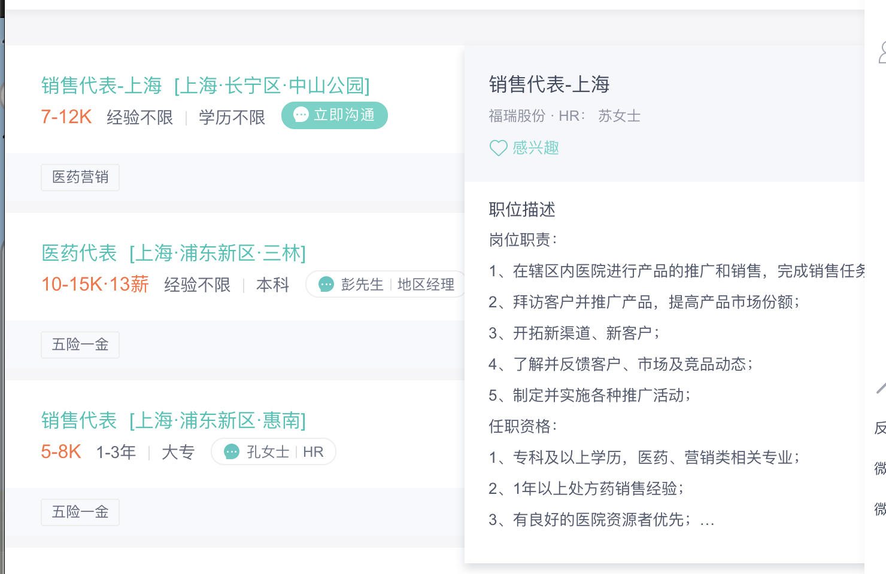

爬取方法见**补充内容**

### 工具

**zhconv** 可以实现中文繁简体的转化，104的接口获得的数据是台湾繁体的，需要转化成简体放到我们的数据库中

- `zh-cn` 大陆简体
- `zh-tw` 台灣正體
- `zh-hk` 香港繁體
- `zh-sg` 马新简体
- `zh-hans` 简体
- `zh-hant` 繁體

```python
from zhconv import convert
convert('Python是一种动态的、面向对象的脚本语言', 'zh-hant')
# 'Python是一種動態的、面向對象的腳本語言'
convert('计算机软件', 'zh-tw')
# '計算機軟體'
convert('計算機軟體', 'zh-hans') # zh-hans只是逐字转换
# '计算机软体'
convert('計算機軟體', 'zh-cn')
# '计算机软件'
```

### API设计（初稿，完整见另外的文档）

[1] GET api/bigjob/getJobs?key1={holland1}&key2={holland2}&key3={holland3}

**Method**: GET     **Return**:JSON

用途：根据

来源：来自爬虫任务中爬到的表

jobCat、bigJobImg、jobDesc、jobName、jobWorks、subject1、subject2

[2] 

来源 https://www.104.com.tw/jb/jobwiki/jobCatMaster/tagCloudJSON?jobcat=2005003008&type=1%2C2%2C3%2C4

【包装】

获取jobCat对应职业的标签信息，这里的jobCat就是上面获取的了，可以获取执照、语言、技能、工具等的标签，可以存下来使用

**Method**: GET     **Return**:JSON

**Example**

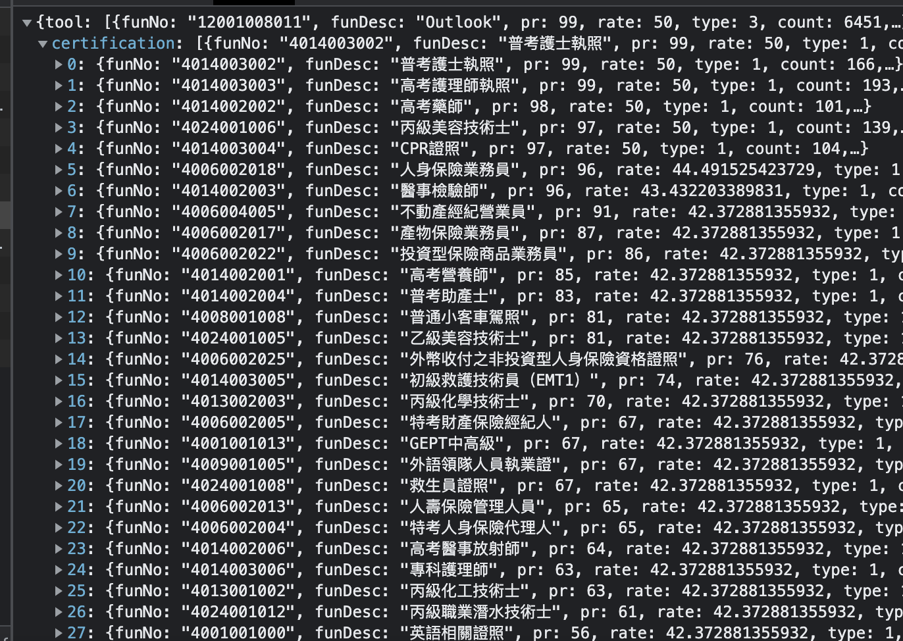

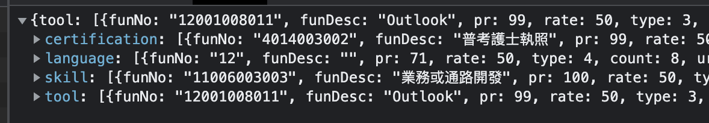

[3] https://www.104.com.tw/jb/jobwiki/jobCatMaster/personality?jobcat=2005003008

不用爬【包装】

职业对应性格分析，要jobcat、desc和big5，这个big5是性格的5维分析，（参考：https://www.104.com.tw/jb/jobwiki/stage/2005003008/2）从第一个到最后一个数字应该分别是“乐观正面”、“团队合作”、...、“创新开放”（感觉应该没问题？需要确定一下）

**Method**: GET     **Return**:JSON

**Example**

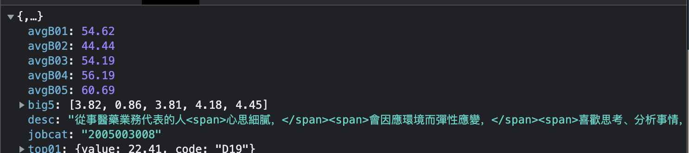

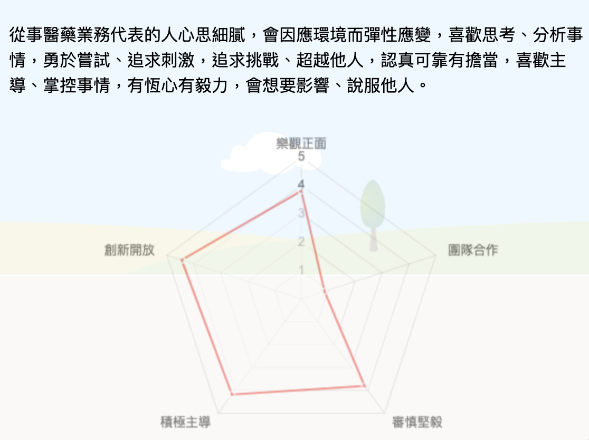

[4] https://www.104.com.tw/jb/jobwiki/jobCatMaster/wage?jobcat=2005003008

【不适用，待分析其他来源】

薪资， 这里有个问题，这里的薪资是按照台湾给的，大陆好像用不了，这里单位是美元，年薪差不多三十万多万，大陆年薪按照职友集给的数据大概就是年薪十多万，所以可能大陆的数据这部分还是得从职友集拿，https://m.jobui.com/job/47136551/

**Method**: GET     **Return**:JSON

**Example**

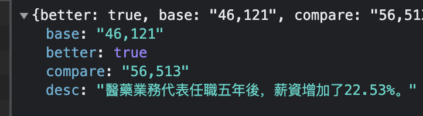

[5] https://www.104.com.tw/jb/jobwiki/jobCatMaster/major?jobcat=2005003008&top=50

获取一下进这个职业前50的专业，【包装】

**Method**: GET     **Return**:JSON

**Example**

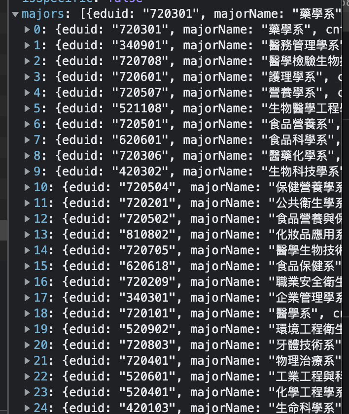

[6] https://www.104.com.tw/jb/jobwiki/jobCatMaster/bmi?jobcat=2005003008

用法：获取工作年龄和性别，包装用，不用爬【包装】

**Method**: GET     **Return**:JSON

**Example**

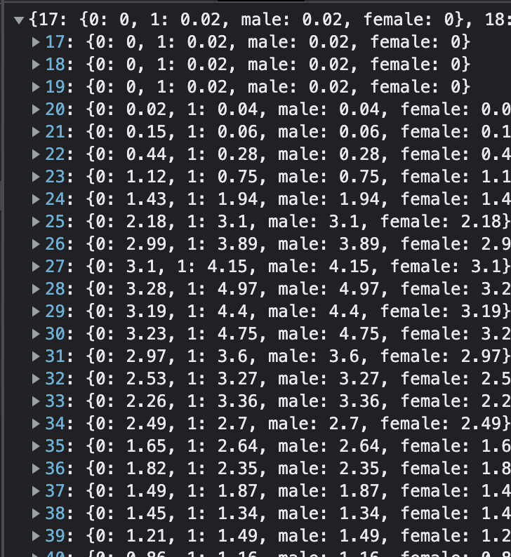

[7] https://www.104.com.tw/jb/jobwiki/jobCatMaster/task?jobcat=2005003008

工作任务说明 【包装】

**Method**: GET     **Return**:JSON

**Example**

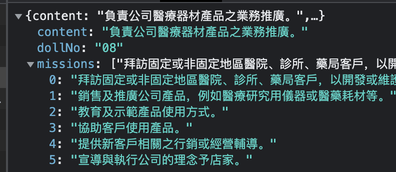

### API状态码

**200 – OK** .

**201 – CREATED**: 新资源已被建立.

**204 – NO CONTENT**: 资源删除成功 (无响应体).

**304 – NOT MODIFIED**: 返回数据是缓存中的内容 (数据没有改变).

**400 – BAD REQUEST**: 请求无效或者服务端无法响应请求. 确切的错误应该在有效载荷中（具体传输的数据包?）中找到. 例如这样的错误 „The JSON is not valid“.

**401 –** **UNAUTHORIZED**: 请求需要用户验证.

**403 – FORBIDDEN**: 拒绝访问.

**404 – NOT FOUND**: 找不到文件.

**500 – INTERNAL SERVER ERROR**: API 开发者应当避免这种错误. 如果这种错误在全局异常中被捕获, stack trace会记录下这个错误并且不会返回响应内容.


### 项目分块

1. hollen code 问卷计算与获取
2. hollen code与bigjob相关的api
3. 工资、公司、学历、工作描述、工作年限要求方面的数据获取与存储，这里的工作名称需要和bigjob的name相关
4. 前端的整合与可视化，前端问卷的制作
5. 工作描述的一些挖掘


**任务分解**

1. restful api文档编写整理，统一命名方式，需要使用swagger [一定难度]
2. hollen code 问卷计算 api实现  [easy]   (post一个问卷表单的结果，计算得到三位hollen code并返回) 
3. hollen code 与与biggjob相关api实现 [一定难度]  
4. 工资、公司、学历、工作描述、工作年限要求方面的数据获取与存储，这里的工作名称需要和bigjob的name相关 [一定难度]   爬虫(1) 两个爬虫
5. 前端问卷制作[普通] 做个页面
6. 前后端api调用、项目部署[普通] 前端
7. [选做]使用NLP对工作描述进行一些挖掘
8. [选做]根据浏览历史实现推荐算法


波波老师： 104爬虫

zzy: hollen code的计算逻辑

另外一个网站爬虫【待定】

前端制作

## 补充内容

boss直聘爬取方法分解：

爬取思路：Selinium + requests接口爬取

https://www.zhipin.com/c101020100/?query=%E5%8C%BB%E8%8D%AF%E4%BB%A3%E8%A1%A8&page=3&ka=page-3 搜索结果页面的安全检查逻辑比较麻烦，涉及一些跳转，接口没找到，所以最终还是用selinium去爬取

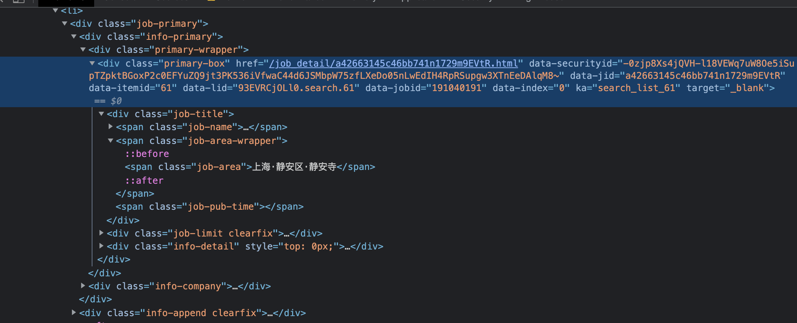

但是job description的那个小卡片的信息放在了js代码里面，接口被找到了，所以只需要用selinium找到一部分信息，再加上job description就可以用了，下面是详细描述

Selinium部分

chrome driver安装连接，建议翻个墙下载，下载与chrome对应版本的driver

https://chromedriver.chromium.org/downloads

chrome版本在这里查看

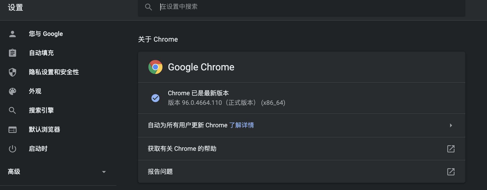

请求搜索url：

url模板: f"https://www.zhipin.com/c101020100/?query={query_str}&page={page_num}&ka=page-{page_num}"

example: "https://www.zhipin.com/c101020100/?query=%E5%8C%BB%E8%8D%AF%E4%BB%A3%E8%A1%A8&page=3&ka=page-3"


需要的信息

每个job都包裹在.job-primary中

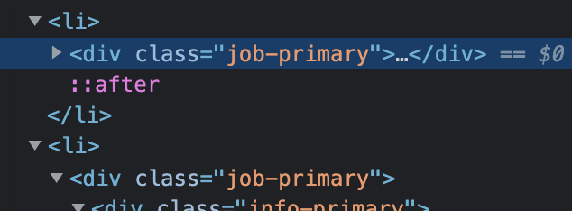

jobSalary(15-30 13薪), jobLimitExperience(经验不限), jobLimitStudy(大专)

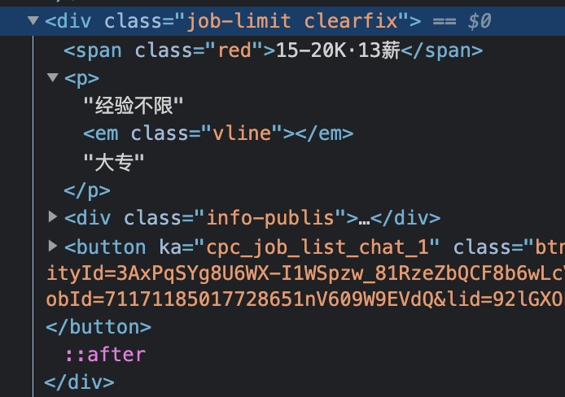

jobName  dataJid  dataLid

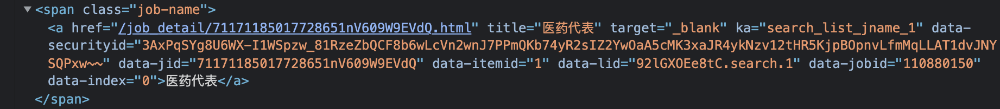

jobArea  **[从这里开始还没有实现]**

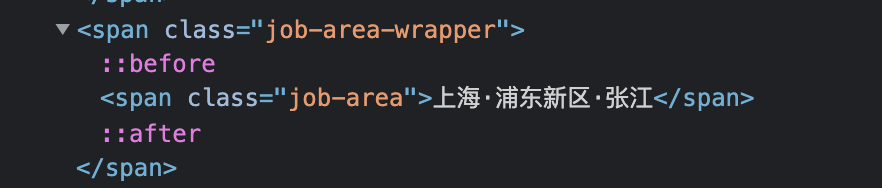

companyName, companyIndustry(企业服务)，financialStatus(已上市)，scale(10000人以上)，companyLogo(https://img....那一串)

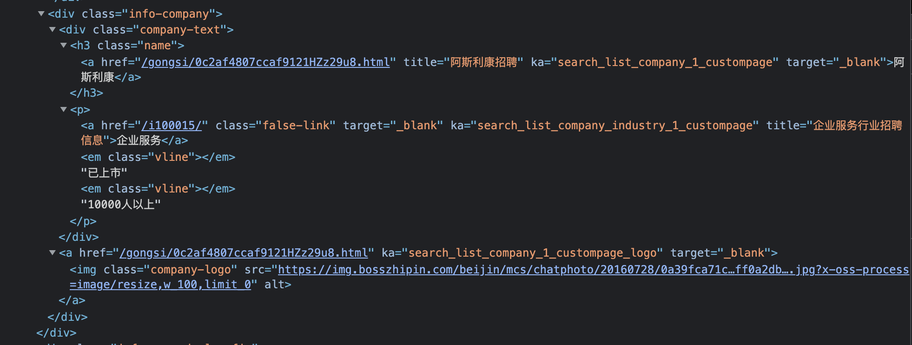

bonus(带薪年假...那一串)

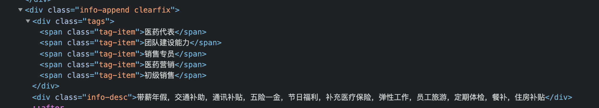

实现只需要模仿jobWebCrawler.py里前面几个部分的实现，把几个数据字段都扒下来就好，